# FFT Tool - Self Testing Report

In order to test the FFT tool, alongside the functionality of the filters, various signals of known composition have been created. The .csv files are created by `generate_test_data.py`. 

Different parameters can be modified - including the frequencies of the signals, relative proportions of injected noise etc...

## Test Data Specifications

- **Sample Rate**: 1000 Hz
- **Duration**: 10 seconds
- **Total Points**: 10,000
- **File Format**: CSV (columns: `time`, `signal`)

**Note** the graphs below reproduced by re-running `generate_test_data.py`. However, the noise proportions and distorion will vary, as some of it is generated in a randomised manner and may not replicate. The images below visualise the signals, their raw FFT, and the **effectiveness of filtering** to clean some of them up.

## Test Case 01: Clean Dual Frequency

**File**: `test_01_clean_dual_freq.csv`

### Description
Clean signal with two sine waves at known frequencies. No noise contamination. This is the baseline test case for validating basic FFT frequency detection accuracy.

### Signal Characteristics
- **Frequencies**: 10.0 Hz, 50.0 Hz
- **Amplitudes**: 1.0, 0.5
- **Noise**: None
- **Sampling**: Uniform

### Expected FFT Peaks
- 10 Hz (amplitude ~1.0)
- 50 Hz (amplitude ~0.5)

### Recommended Filter Settings
None required. Clean signal.

### Results

Below is is a truncated proportion of the raw signal, and it's corresponding FFT. The purple line represents the frequency response (NOT in the logarithmic domain).

### Filter Results

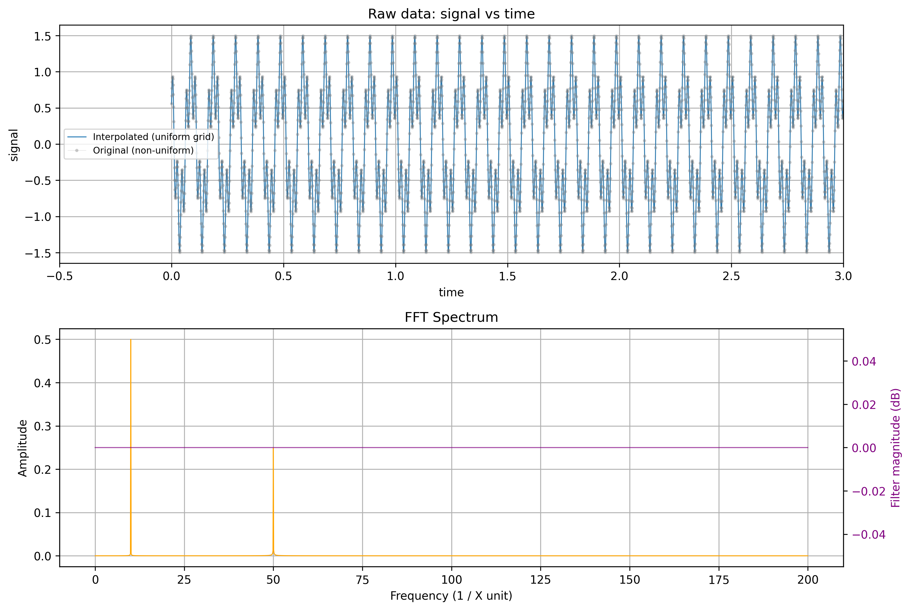

This is used as a simple test of the High pass cut off, which is set ot order 8, at a frequency of 10 Hz which does indeed attenuate the 10 Hz signal as seen below!

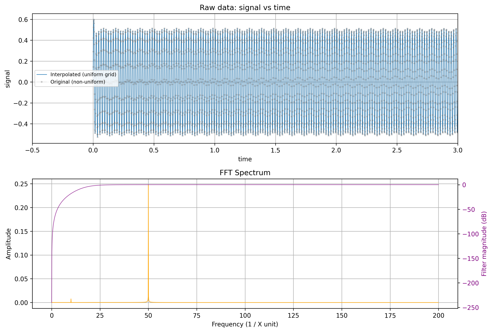

## Test Case 02: Multiple Frequencies with White Noise

**File**: `test_02_multi_freq_white_noise.csv`

### Description
Signal with four distinct sine waves plus moderate white noise. Tests the FFT's ability to detect multiple frequencies in noisy data.

### Signal Characteristics
- **Frequencies**: 5.0 Hz, 25.0 Hz, 100.0 Hz, 150.0 Hz
- **Amplitudes**: 2.0, 1.0, 0.8, 0.6
- **Noise**: White noise (amplitude: 0.2)
- **Sampling**: Uniform

### Expected FFT Peaks
- 5 Hz (amplitude ~2.0)
- 25 Hz (amplitude ~1.0)
- 100 Hz (amplitude ~0.8)
- 150 Hz (amplitude ~0.6)

### Recommended Filter Settings
- **High-pass**: 0.1-1 Hz (remove DC)
- **Low-pass**: 200 Hz (remove high-frequency noise above signal)
- **Bandpass**: 1-200 Hz (isolate signal band)

This signal and agreeing FFT was verified, with some independent filtering verifications. Graphics of results have not been recorded.

## Test Case 03: High-Frequency Noise Contamination

**File**: `test_03_high_freq_noise.csv`

### Description
Signal with 20 Hz and 60 Hz components plus strong high-frequency noise. Tests low-pass filter effectiveness for removing high-frequency contamination.

### Signal Characteristics
- **Frequencies**: 20.0 Hz, 60.0 Hz
- **Amplitudes**: 1.5, 1.0
- **Noise**: 
  - White noise: 0.1
  - High-frequency noise: 0.5 (strong)
- **Sampling**: Uniform

### Expected FFT Peaks
- 20 Hz (amplitude ~1.5)
- 60 Hz (amplitude ~1.0)
- Broad high-frequency noise floor

### Recommended Filter Settings
- **Median filter**: Optional
- **High-pass**: 0.1-1 Hz (remove DC)
- **Low-pass**: 80-100 Hz (critical - remove high-frequency noise)
- **Notch**: Not needed
- **Bandpass**: 10-80 Hz (isolate signal, remove high-freq noise)

### Results

High frequency noise injected, which pollutes the signal. Even though the peaks are obvious, if there were lower amplitude signals of interest at higher freq.  (towards the 0.5 kHz range) they may get masked!

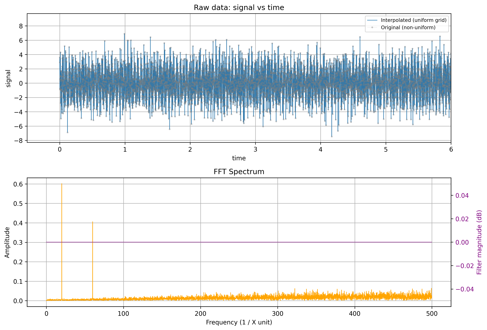

This signal is suitable for testing the low pass filter – we have also zoomed into the data on the top graph on the X-axis. Observe that applying an 8th order filter, with the corner frequency at 120 Hz does indeed clean up the signal significantly. 

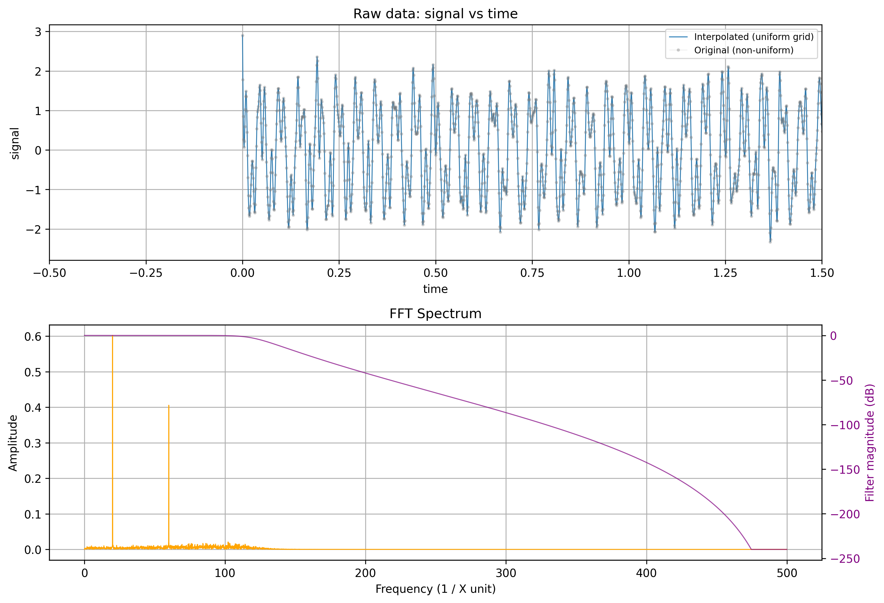

## Test Case 04: Low-Frequency Drift/Noise

**File**: `test_04_low_freq_drift.csv`

### Description
Signal with 30 Hz and 80 Hz components plus low-frequency drift. Tests high-pass filter effectiveness for removing DC offset and slow drift.

### Signal Characteristics
- **Frequencies**: 30.0 Hz, 80.0 Hz
- **Amplitudes**: 1.0, 0.7
- **Noise**: 
  - White noise: 0.15
  - Low-frequency drift: 0.3 (strong)
- **Sampling**: Uniform

### Expected FFT Peaks
- 30 Hz (amplitude ~1.0)
- 80 Hz (amplitude ~0.7)
- Large DC/low-frequency component

### Recommended Filter Settings
- **High-pass**: 1-5 Hz (critical - remove drift and DC) - ise a fairly high order.
- **Low-pass**: 100 Hz (remove high-frequency noise)
- **Bandpass**: 10-100 Hz (isolate signal to band of interest)

This signal and agreeing FFT was verified, with some independent filtering verifications. Graphics of results have not been recorded.

## Test Case 05: Mains Frequency (50 Hz) Interference

**File**: `test_05_mains_interference.csv`

### Description
Signal with desired frequencies (15 Hz, 75 Hz) plus strong 50 Hz mains interference. Tests notch filter effectiveness at removing specific interference frequencies.

### Signal Characteristics
- **Frequencies**: 15.0 Hz, 50.0 Hz, 75.0 Hz
- **Amplitudes**: 1.0, 2.0, 0.8 (50 Hz is interference)
- **Noise**: White noise: 0.2
- **Sampling**: Uniform

### Expected FFT Peaks
- 15 Hz (amplitude ~1.0) - desired
- 50 Hz (amplitude ~2.0) - interference (should be removed)
- 75 Hz (amplitude ~0.8) - desired

### Recommended Filter Settings
- **Notch**: 50 Hz (critical - remove mains interference)

### Results
Test case 5 raw spectrum highlighting strong mains interference around 50 Hz. 

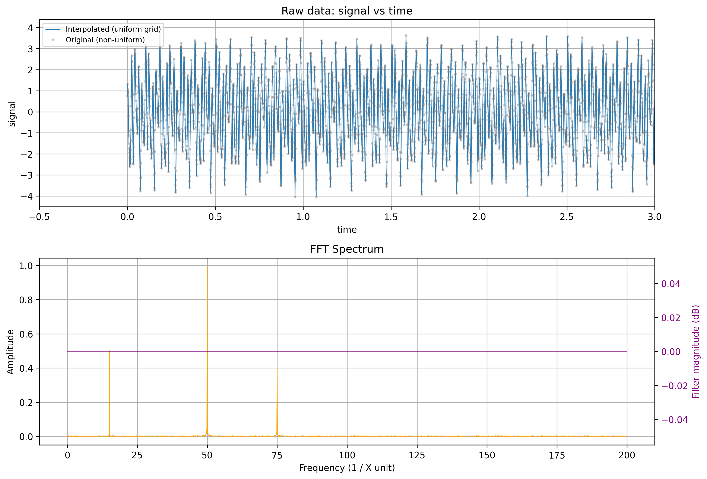

Observe below that the notch filter is applied at 52 Hz, with a Q-factor of 7. Because of the smearing of the band-stop, it attenuates some of the main noise but not all of it, and is still quite strong relative to the signal.

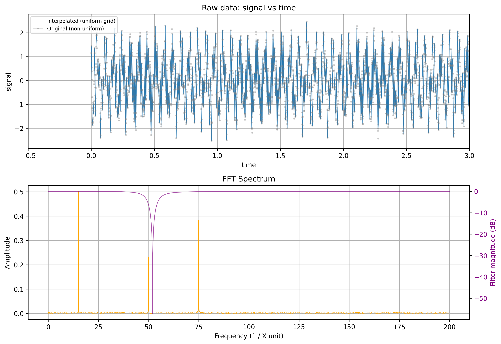

Now the Notch filter is applied much closer to the rejection frequency at 50.1 Hz. The quality factor is still not perfect, at Q = 10. **NOTE:** this is simply to simulate a slightly imperfect, electronic notch filter. It is a good compromise by not having a perfect quality factor, and because of very real fluctuations in frequency mains noise, losses in the filter itself can be represented (essentially, 'worse' attenuation).

So counterintuitively, a lower quality factor, which reduces the sharpness of the band stop is actually better if the filter is not centred at the EXACT frequency we want to reject. However – it still almost completely gets rid of the mains component!

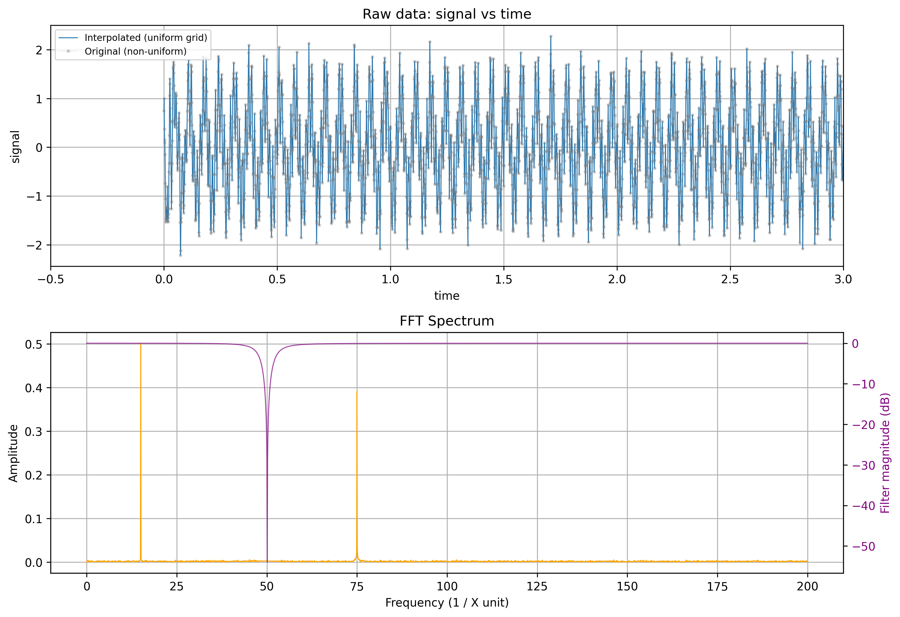

---

## Test Case 06: Multiple Notch Frequencies

**File**: `test_06_multiple_notch_freqs.csv`

### Description
Signal with desired frequencies (25 Hz, 125 Hz) plus interference at 50 Hz and 100 Hz. Tests multiple notch filters simultaneously.

### Signal Characteristics
- **Frequencies**: 25.0 Hz, 50.0 Hz, 100.0 Hz, 125.0 Hz
- **Amplitudes**: 1.5, 1.8, 1.6, 1.2 (50 & 100 Hz are interference)
- **Noise**: White noise: 0.15
- **Sampling**: Uniform

### Expected FFT Peaks
- 25 Hz (amplitude ~1.5) - desired
- 50 Hz (amplitude ~1.8) - interference (should be removed)
- 100 Hz (amplitude ~1.6) - interference (should be removed)
- 125 Hz (amplitude ~1.2) - desired

### Recommended Filter Settings
- **High-pass**: 0.1-1 Hz
- **Low-pass**: 150 Hz - combined with the HP, forms a band-pass to focus on the frequency band of interest.
- **Notch**: 50 Hz, 100 Hz (critical - remove both interference frequencies)
 

This signal and agreeing FFT was verified, with some independent filtering verifications. Graphics of results have not been recorded.

---

## Test Case 07: Non-Uniform Sampling

**File**: `test_07_nonuniform_sampling.csv`

### Description
Signal with non-uniform time spacing (10% jitter). Tests interpolation accuracy and FFT behavior with irregular sampling.

### Signal Characteristics
- **Frequencies**: 12.0 Hz, 45.0 Hz
- **Amplitudes**: 1.0, 0.6
- **Noise**: White noise: 0.1
- **Sampling**: Non-uniform (10% jitter)

### Expected FFT Peaks
- 12 Hz (amplitude ~1.0)
- 45 Hz (amplitude ~0.6)

### Recommended Filter Settings
None used, simply validating robustness of FFT with non-uniformly sampled data.

### Results
This test case validates that the interpolation step correctly handles non-uniform sampling before FFT analysis. Observe from the grey dots in the image the irregular smapling period. However, the rate remains above Nyquist, and is sufficient to reconstruct the superposed frequencies at 12 Hz and 45 Hz.

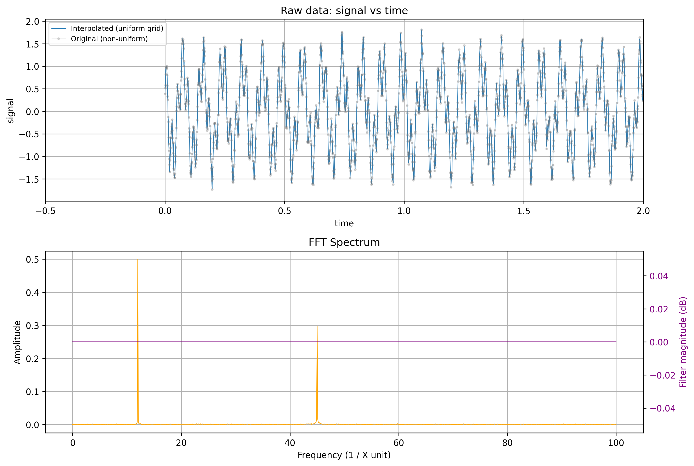

---

## Test Case 08: Very Noisy Signal (Low SNR)

**File**: `test_08_low_snr.csv`

### Description
Weak signals buried in strong noise. Tests filter pipeline effectiveness for low signal-to-noise ratio scenarios.

### Signal Characteristics
- **Frequencies**: 35.0 Hz, 90.0 Hz
- **Amplitudes**: 0.35, 0.3 (weak signals)
- **Noise**: 
  - White noise level: 1.5 (strong - SNR ~ 0.5)
  - High-frequency noise: 0.55
  - Low-frequency noise: 0.45
- **Sampling**: Uniform

### Expected FFT Peaks
- 35 Hz (amplitude ~0.5) - may be difficult to detect
- 90 Hz (amplitude ~0.4) - may be difficult to detect
- High noise floor

### Recommended Filter Settings
- **Median filter**: Recommended (k=5-7)
- **High-pass**: 10 Hz (remove drift)
- **Low-pass**: 120 Hz (remove high-freq noise)
- **Bandpass**: 20-120 Hz (isolate signal band, reduce noise)

This is a purposefully polluted signal with peaks at 35 Hz and 90 Hz – with a fairly low SNR. ALthough the noise is fairly low amplitude relative to the signal, the spectrum is clearly now clean, and smaller amplitudes of other signals may be masked.

### Filter Results

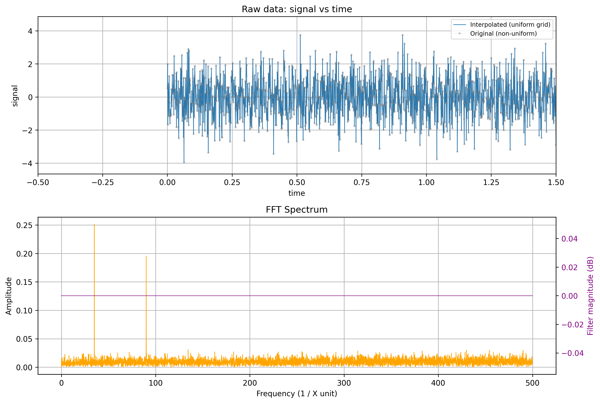

Cleaning it up is best with a bandpass. The low pass is set to 120 Hz, an the High pass to 10 Hz – both with an order 8 roll-off. This removes most of the high frequency, and very low frequency drift content. A median filter is also used in general to reject spikes around data points which ‘are’ actually meant to peak at the corresponding frequencies.

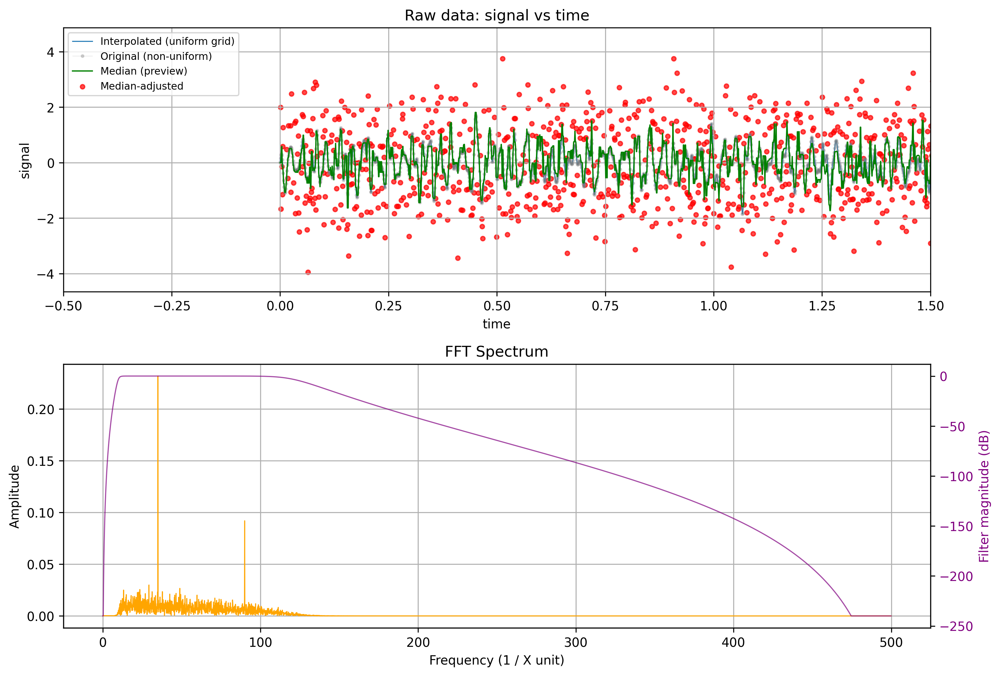

---

## Test Case 09: Close Frequency Pairs

**File**: `test_09_close_frequencies.csv`

### Description
Signal with closely spaced frequencies. Tests FFT frequency resolution and ability to distinguish nearby peaks.

### Signal Characteristics
- **Frequencies**: 40.0 Hz, 40.5 Hz, 95.0 Hz, 96.0 Hz
- **Amplitudes**: 1.0, 0.9, 0.8, 0.7
- **Noise**: White noise: 0.1
- **Sampling**: Uniform

### Expected FFT Peaks
- 40.0 Hz (amplitude ~1.0)
- 40.5 Hz (amplitude ~0.9) - close to 40 Hz
- 95.0 Hz (amplitude ~0.8)
- 96.0 Hz (amplitude ~0.7) - close to 95 Hz

### Recommended Filter Settings
- **Notch**: 96 Hz, with Q factor of 50.

### Results

This data validates the frequency resolution. With 10 seconds of data, frequency resolution is ~0.1 Hz, so 40.0/40.5 Hz and 95.0/96.0 Hz should be distinguishable. The image below indeed depict good reconstruction of the present signals.

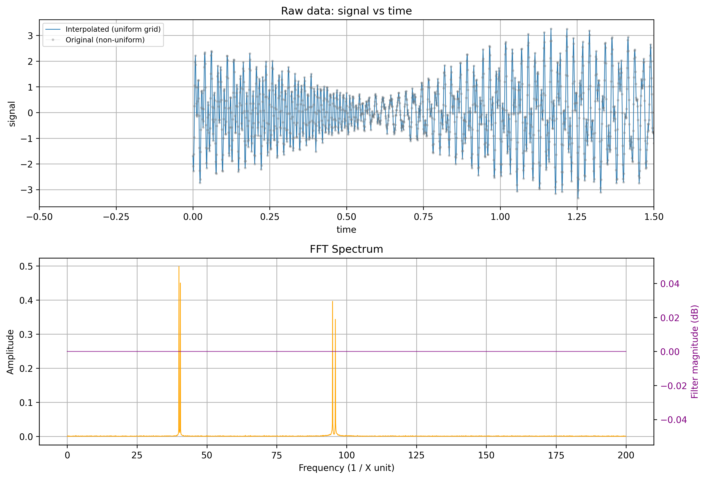

The notch filter is applied, with a quality factor of 50 (huge!) centred at 96 Hz. Unfortunately it does indeed attenuate the nearby pair by 50 %, but given the fairly high SNR, the 95 Hz signal is still sufficiently distinguishable.

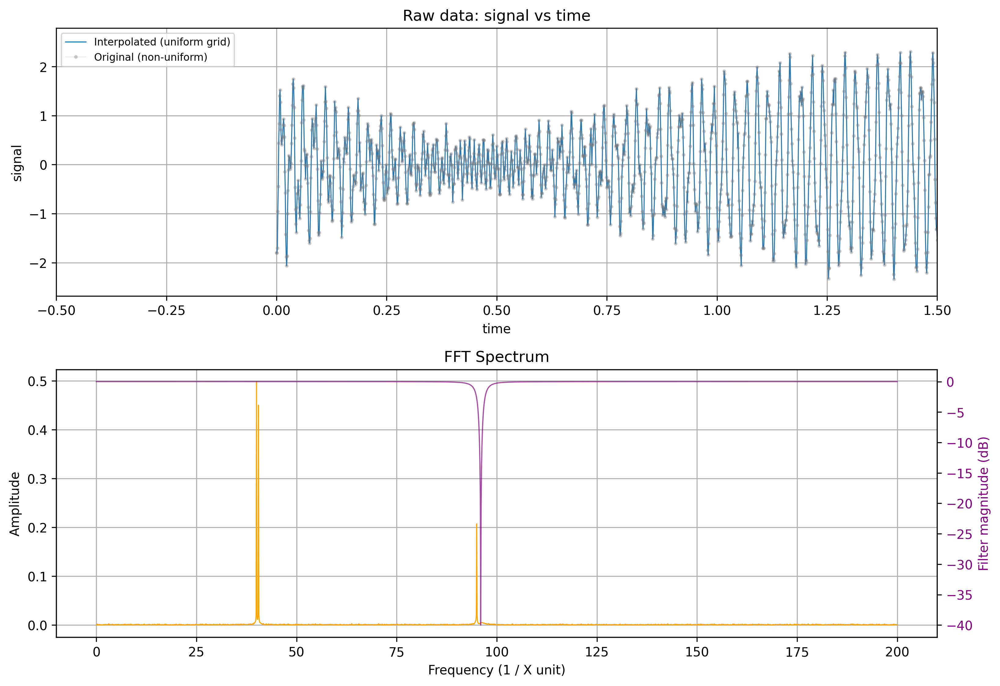

---

## Test Case 10: Wide Frequency Range

**File**: `test_10_wide_freq_range.csv`

### Description
Signal with frequencies spanning a wide range (2-200 Hz). Tests FFT performance across wide frequency range and filter bandwidth selection.

### Signal Characteristics
- **Frequencies**: 2.0 Hz, 20.0 Hz, 100.0 Hz, 200.0 Hz
- **Amplitudes**: 1.2, 1.0, 0.9, 0.7
- **Noise**: White noise: 0.15
- **Sampling**: Uniform

### Expected FFT Peaks
- 2 Hz (amplitude ~1.2)
- 20 Hz (amplitude ~1.0)
- 100 Hz (amplitude ~0.9)
- 200 Hz (amplitude ~0.7)

### Recommended Filter Settings
- **High-pass**: 0.5-1 Hz (remove DC, keep 2 Hz)
- **Low-pass**: 250 Hz (keep all frequencies)
However no filtering would be required for this, given there is no noise injection. Quite pure superposition of varying frequency signal.

This signal and agreeing FFT was verified, with some independent filtering verifications. Graphics of results have not been recorded.
---

## Test Case 11: Spike Contamination

**File**: `test_11_spikes.csv`

### Description
Signal with 30 Hz and 70 Hz components plus random large spikes. Tests median filter effectiveness for removing outliers and spikes.

### Signal Characteristics
- **Frequencies**: 30.0 Hz, 70.0 Hz
- **Amplitudes**: 1.0, 0.8
- **Noise**: White noise: 0.1
- **Spikes**: 50 random spikes with amplitude ±5.0
- **Sampling**: Uniform

### Expected FFT Peaks
- 30 Hz (amplitude ~1.0)
- 70 Hz (amplitude ~0.8)
- Broad spectrum from spikes

### Recommended Filter Settings
- **Median filter**: Critical (k=5-7 recommended)
- **High-pass**: 0.1-1 Hz
- **Low-pass**: 100 Hz

This signal and agreeing FFT was verified, with some independent filtering verifications. Graphics of results have not been recorded.

---

## Test Case 12: All Noise Types Combined

**File**: `test_12_all_noise_types.csv`

### Description
Comprehensive test with multiple frequencies plus all types of noise contamination. Tests the complete filter pipeline working together.

### Signal Characteristics
- **Frequencies**: 18.0 Hz, 55.0 Hz, 120.0 Hz
- **Amplitudes**: 1.5, 1.2, 1.0
- **Noise sources**:
  1. **Broadband (white) noise** – zero-mean Gaussian component scaled to roughly six times the base standard deviation, flooding the entire spectrum (thermal / ADC-like).
  2. **Ultra-low-frequency coloured noise** – 1/f-shaped energy concentrated below 50 Hz, scaled about eightfold to produce aggressive baseline wander.
  3. **Random-walk drift** – cumulative sum of white noise (<1 Hz) scaled by ~4.5×, mimicking sensor bias drift over time.
  4. **Dense harmonic bed** – around 20 random sinusoids (5–500 Hz) with amplitudes between 0.5 and 3.0, representing overlapping mechanical/electrical resonances.
  5. **Impulsive spikes** – 80 large-amplitude impulses (±5 to ±15 units) scattered throughout, imitating EMI bursts or encoder glitches.
- **Sampling**: Uniform

### Expected FFT Peaks
- 18 Hz (amplitude ~1.5)
- 55 Hz (amplitude ~1.2)
- 120 Hz (amplitude ~1.0)
- High noise floor from all sources

### Recommended Filter Settings
- **Median filter**: Critical (k=5-7) - remove spikes
- **High-pass**: 1-5 Hz - remove drift
- **Low-pass**: 150 Hz - remove high-freq noise
- **Notch**: Optional (if specific interference present)
- **Bandpass**: 10-150 Hz - isolate signal band

### Results

Test case 12 is the deliberately ugly one: brutal SNR so the peaks at 18.0, 55.0, and 120.0 Hz get buried. Step one is a broad 15–125 Hz band-pass plus a median filter to pull the signal back out.

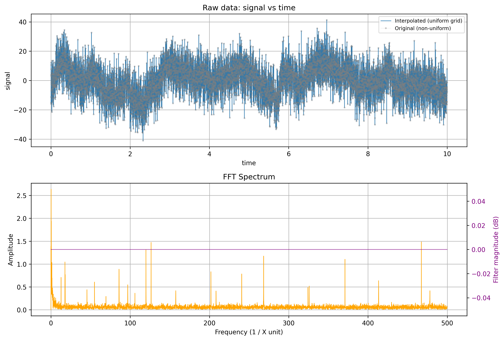

Next up, crank the median kernel to 5 and pair it with that order-40 band-pass. It looks heavy-handed, but it chops off most of the broadband spray and leaves the three keepers standing.

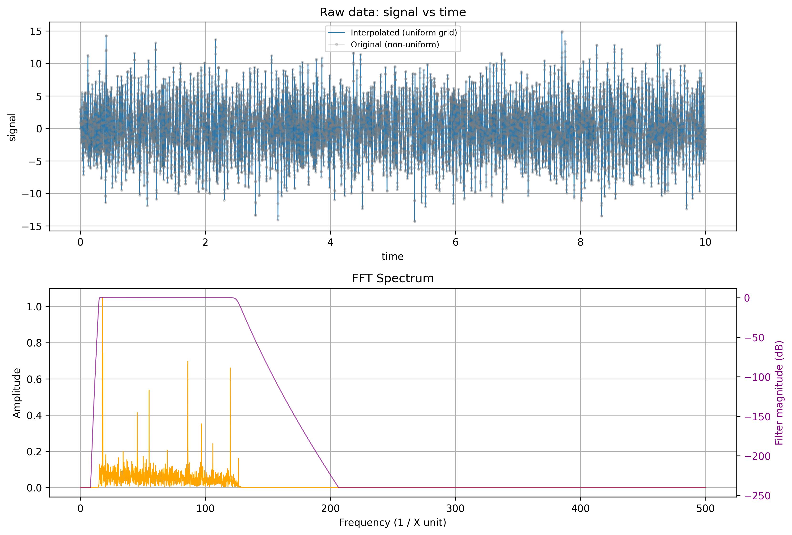

Worth noting: the median filter alone already does a lot. It nukes the random spikes and tames the high-frequency fizz without needing a full filter stack.

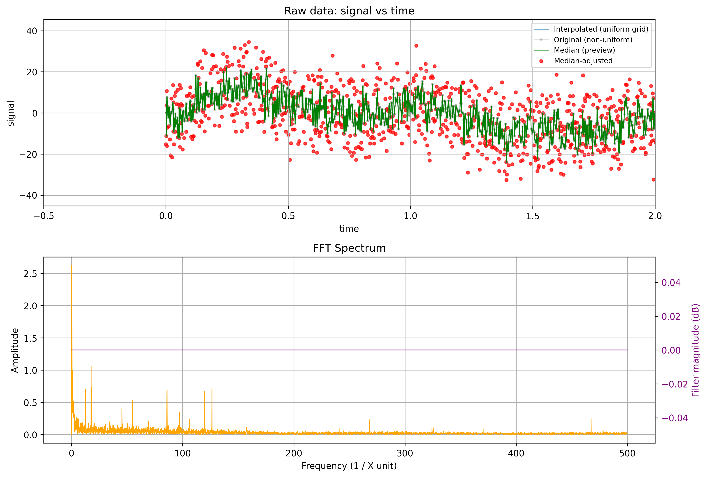

Finally, because we know exactly where the real tones live, we can throw in low-Q notches at 38 Hz and 85 Hz—right between the pairs. They carve out the mush while keeping the three target peaks tall.

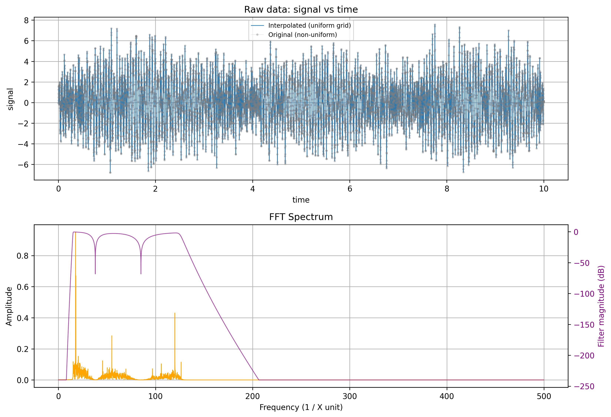

---

## Filter Pipeline Order

The filters are applied in the following fixed order:

1. **Median filter** - Removes spikes and outliers. 
2. **High-pass filter** - Removes DC offset and low-frequency drift
3. **Notch filter** - Removes specific interference frequencies
4. **Low-pass filter** - Removes high-frequency noise
5. **Bandpass filter** - Passes only a specific frequency band
6. **Savitzky-Golay** - Additional SavGol filter smoothing.

Each filter can be independently enabled/disabled. The pipeline order is fixed, but filters operate on the cumulative result of all previous enabled filters, therefore will be superposed, but 'prior' filtered data.

---

## Notes

- All test cases use a sample rate of 1000 Hz and duration of 10 seconds
- Frequency resolution: ~0.1 Hz (1/duration)
- Maximum detectable frequency: ~500 Hz (Nyquist = sample_rate/2)
- Test cases can be regenerated by running `generate_test_data.py`
- Existing files are not overwritten to preserve test results

---
